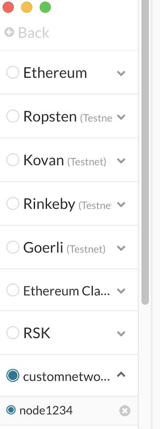

# blockchain-homework

# BUILDING THE BLOCKCHAIN

## Proof of Authority Development Chain

## Instrictions to setup the custom out-of-the-box blockchain

The Proof of Authority (PoA) algorithm is typically used for private blockchain networks as it requires pre-approval of, or voting in of, the account addresses that can approve transactions (seal blocks).

Because the accounts must be approved, we generated two new nodes with new account addresses that will serve as our pre-approved sealer addresses.

- Created accounts for two nodes for the network with a separate datadir for each using geth.
    ./geth --datadir node1 account new
    ./geth --datadir node2 account new
<kbd>

- Next, generated the genesis block.

- Puppeth was run, named the network, and selected the option to configure a new genesis block.

- Chose the Clique (Proof of Authority) consensus algorithm.

- Pasted both account addresses from the first step one at a time into the list of accounts to seal.

- Pasted them again in the list of accounts to pre-fund. There are no block rewards in PoA, so you'll need to pre-fund.
<kbd>

- Continued with the default option for the prompt that asks, Should the precompile-addresses (0x1 .. 0xff) be pre-funded with 1 wei?

- Completed the rest of the prompts, and from the main menu, chose the "Manage existing genesis" option.

- Exported genesis configurations. This failed to create two of the files, but created networkname.json

- With the genesis block creation completed, nitialized the nodes with the genesis' json file.

- Using geth, initialized each node with the new networkname.json.
    ./geth --datadir node1 init networkname.json
    ./geth --datadir node2 init networkname.json

- The nodes were then used to begin mining blocks.

- In separate terminal windows,  the commands were run to run the nodes:
    ./geth --datadir node1 --unlock "SEALER_ONE_ADDRESS" --mine --rpc --allow-insecure-unlock
    ./geth --datadir node2 --unlock "SEALER_TWO_ADDRESS" --mine --port 30304 --bootnodes "enode://SEALER_ONE_ENODE_ADDRESS@127.0.0.1:30303" --ipcdisable --allow-insecure-unlock

    Password was entered and hit entered. 

<kbd>

<kbd>

#### Private PoA blockchain was running!

- With both nodes up and running, the blockchain was to MyCrypto for testing.

- Opened the MyCrypto app, then clicked Change Network at the bottom left:

    Clicked "Add Custom Node", then added the custom network information that was set in the genesis.

<kbd>

- Then Chose Custom in the "Network" column to reveal more options like Chain ID:

- Typed ETH in the Currency box.

- In the Chain ID box, type the chain id was entered.

- In the URL box typed: http://127.0.0.1:8545.  This points to the default RPC port on your local machine.

- Finally, clicked Save & Use Custom Node.

- After connecting to the custom network in MyCrypto, it was tested by sending money between accounts.

- Selected the View & Send option from the left menu pane, then click Keystore file.

- On the next screen, clicked Select Wallet File, then navigated to the keystore directory inside your Node1 directory, selected the file located there, provided the password when prompted and then clicked Unlock.

- This opened the account wallet inside MyCrypto.

- There were millions of ETH tokens are just for testing purposes which is the balance that was pre-funded for this account in the genesis configuration.

- In the To Address box, typed the account address from Node2, then filled in an arbitrary amount of ETH:

- Confirmed the transaction by clicking "Send Transaction", and then the "Send" button in the pop-up window.

<kbd>

- Clicked the Check TX Status 

<kbd>

#### The transaction went from Pending to Successful!