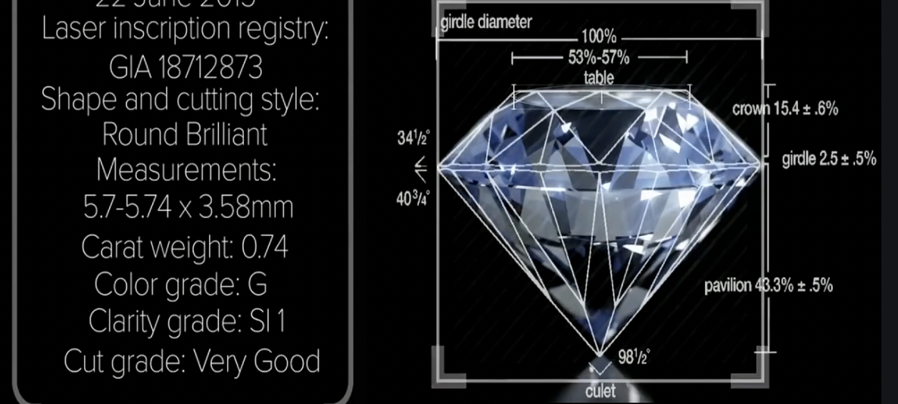
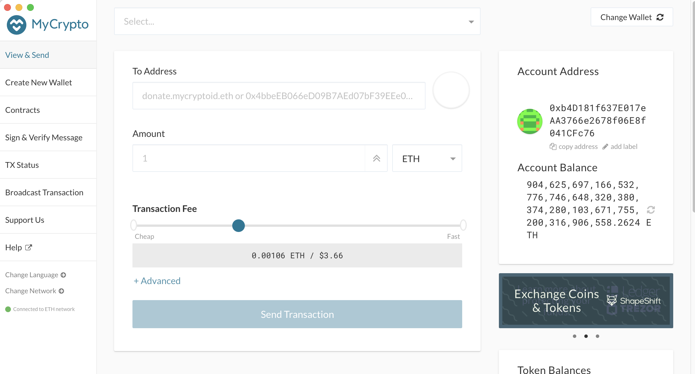
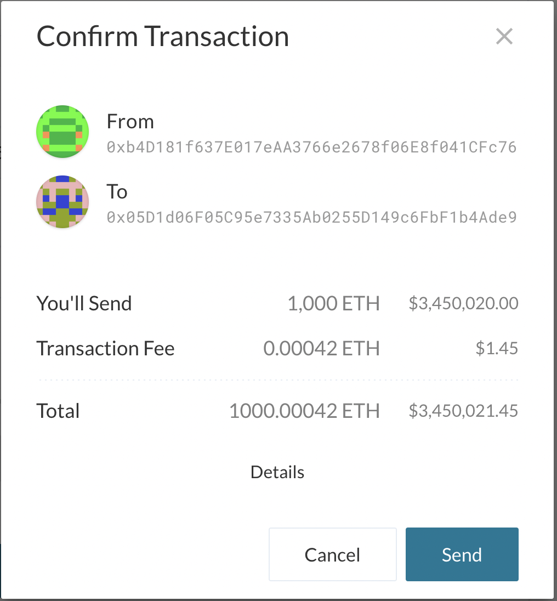

blockchain-homework
# BLOCKCHAIN CASE STUDY 

## EVERLEDGER 
Everledger is the digital transparency company, providing technology solutions to increase transparency in global supply chains. Their purpose is to contribute greater clarity and confidence in the marketplaces where transparency is a strategic imperative.

### Everledger wins major Australian Government critical minerals blockchain pilot project
The world’s first digital blockchain pilot for critical minerals is a collaboration between Everledger and significant contributors from Australia and world experts.

Everledger’s blockchain technology will be used to create a ‘digital certification’ for critical minerals throughout the supply chain from extraction to processing and export to global markets. The pilot will help companies in the sector adhere to compliance regulations and increase the demand for Australian minerals in global markets while also simplifying the process and lowering costs.

<kbd>

#### Everledger has always been about the power of many. Where Supply chains meet the blockchain!

### Founder & CEO: Australian Leanne Kemp, 47
Words form CEO - “We are thrilled to win this pilot project from the Australian Government. The race is on for rare earths and other critical minerals. Australian critical minerals are some of the highest quality in the world. More importantly, they are the essential building blocks for the clean energy technologies of the future.”

Developed a blockchain to track the movement of goods from raw materials source to sales, with its first application tracking diamonds to make sure they don’t come from conflict zones. Now expanding to track cobalt, having signed a contract with the U.S. Department of Energy and a battery trade group in New Zealand.

Funding: $20 million  Tencent, Graphene, Rakuten and others; latest valuation of $100 million

Bonafides: 2 million diamonds totaling 900,000 carats are currently being tracked on Everledger’s blockchain, which is being used by 100 stores at the Fred Meyer Jewelers chain in the U.S.

A new, more transparent economy

## Blockchain in Everledger 
Blockchain helps to build trust and transparency by enabling an audit trail of persistent object identity over time. The Everledger Platform operates on a private blockchain network with enterprise speed and capability, where object details and associated processing events can be easily added. This data writes new information to the ledger in what is considered a ‘block.’ 
### Each new block contains within it a cryptographic hash, and because all records are connected by their hash value, they are immutable and cannot be changed.

<kbd>

## Challenge
Given the rapid growth in China’s e-commerce, luxury jewellery retailers are increasingly looking to digitally connect with their consumers and build brand loyalty online. The rise of online shopping is of key importance in the Chinese market, where digitally-savvy millennials account for 68% of diamond sales compared to only 45% worldwide.
Amidst this shift to online, one of the biggest challenges facing diamond retailers and e-commerce platforms is diamond fraud, with many Chinese consumers reluctant to shop online due to concerns about synthetic diamonds or fraudulent certificates. The limited access to secure and trustworthy information about the quality and authenticity of the diamonds and their accompanying certification is preventing Chinese consumers embracing the e-commerce revolution when buying diamond jewellery.

Now more than ever, trusted certification authorities and leading brands must come together to help online consumers enjoy and feel confident when buying from their favourite brands. 

## Solution
Everledger and JD.com successfully implemented an inter-blockchain collaboration which combined with GIA’s long established diamond grading expertise established diamond grading expertise to increase trust and transparency and enhance the digital ecommerce experience for consumers. With that provides customers with independently verified diamond certificate and origin information and the Algorithms help them to identify and reduce the fraudulent use of GIA reports, such as by checking that multiple diamonds aren’t being sold with the same report.

This also enabled customers can check the validity of a GIA diamond grading report and have online access to valuable insights into the characteristics of their diamond before the diamond and its GIA report even arrives at their doorstep.

## Results
The application of blockchain technology in e-commerce to store verifiable grading report information on the blockchain for consumers to interact with provides unprecedented levels of transparency into the quality and authenticity of the diamonds consumers purchase online. This enhances the digital e-commerce experience and builds more trust in China’s online jewellery market.
Their solution is also supplemented with livestreams and customer education initiatives to help customers learn how to avoid fraudulent activity when purchasing diamonds, all of which will provide a superior digital user experience

<em>Further details of the case study is located in the ever-ledger-case-study.md document file inside the folder blockchain-case-study</em>

# BUILDING THE BLOCKCHAIN

## Proof of Authority Development Chain

## Instrictions to setup the custom out-of-the-box blockchain

The Proof of Authority (PoA) algorithm is typically used for private blockchain networks as it requires pre-approval of, or voting in of, the account addresses that can approve transactions (seal blocks).

Because the accounts must be approved, we generated two new nodes with new account addresses that will serve as our pre-approved sealer addresses.

- Created accounts for two nodes for the network with a separate datadir for each using geth.
    ./geth --datadir node1 account new
    ./geth --datadir node2 account new
<kbd>

- Next, generated the genesis block.

- Puppeth was run, named the network, and selected the option to configure a new genesis block.

- Chose the Clique (Proof of Authority) consensus algorithm.

- Pasted both account addresses from the first step one at a time into the list of accounts to seal.

- Pasted them again in the list of accounts to pre-fund. There are no block rewards in PoA, so you'll need to pre-fund.
<kbd>

- Continued with the default option for the prompt that asks, Should the precompile-addresses (0x1 .. 0xff) be pre-funded with 1 wei?

- Completed the rest of the prompts, and from the main menu, chose the "Manage existing genesis" option.

- Exported genesis configurations. This failed to create two of the files, but created networkname.json

- With the genesis block creation completed, nitialized the nodes with the genesis' json file.

- Using geth, initialized each node with the new networkname.json.
    ./geth --datadir node1 init networkname.json
    ./geth --datadir node2 init networkname.json

- The nodes were then used to begin mining blocks.

- In separate terminal windows,  the commands were run to run the nodes:
    ./geth --datadir node1 --unlock "SEALER_ONE_ADDRESS" --mine --rpc --allow-insecure-unlock
    ./geth --datadir node2 --unlock "SEALER_TWO_ADDRESS" --mine --port 30304 --bootnodes "enode://SEALER_ONE_ENODE_ADDRESS@127.0.0.1:30303" --ipcdisable --allow-insecure-unlock

    Password was entered and hit entered. 

<kbd>

<kbd>

#### Private PoA blockchain was running!

- With both nodes up and running, the blockchain was to MyCrypto for testing.

- Opened the MyCrypto app, then clicked Change Network at the bottom left:

    Clicked "Add Custom Node", then added the custom network information that was set in the genesis.

<kbd>

- Then Chose Custom in the "Network" column to reveal more options like Chain ID:

- Typed ETH in the Currency box.

- In the Chain ID box, type the chain id was entered.

- In the URL box typed: http://127.0.0.1:8545.  This points to the default RPC port on your local machine.

- Finally, clicked Save & Use Custom Node.

- After connecting to the custom network in MyCrypto, it was tested by sending money between accounts.

- Selected the View & Send option from the left menu pane, then click Keystore file.

- On the next screen, clicked Select Wallet File, then navigated to the keystore directory inside your Node1 directory, selected the file located there, provided the password when prompted and then clicked Unlock.

- This opened the account wallet inside MyCrypto.

- There were millions of ETH tokens are just for testing purposes which is the balance that was pre-funded for this account in the genesis configuration.

- In the To Address box, typed the account address from Node2, then filled in an arbitrary amount of ETH:

- Confirmed the transaction by clicking "Send Transaction", and then the "Send" button in the pop-up window.

<kbd>

- Clicked the Check TX Status 

<kbd>

#### The transaction went from Pending to Successful!