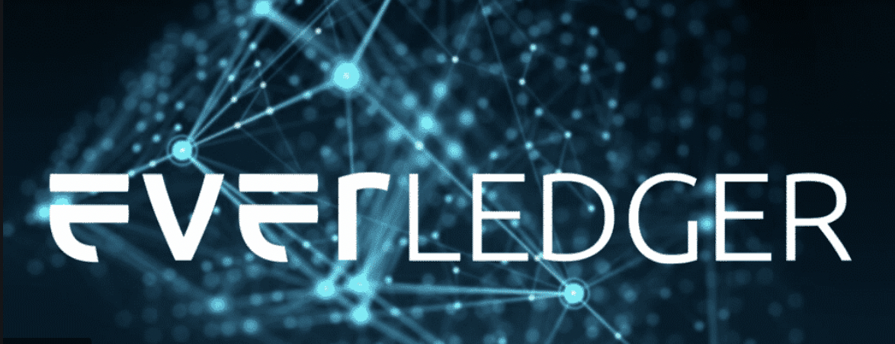

# blockchain-homework

# BLOCKCHAIN CASE STUDY 

## EVERLEDGER 
Everledger is the digital transparency company, providing technology solutions to increase transparency in global supply chains. Their purpose is to contribute greater clarity and confidence in the marketplaces where transparency is a strategic imperative.

### Everledger wins major Australian Government critical minerals blockchain pilot project
The world’s first digital blockchain pilot for critical minerals is a collaboration between Everledger and significant contributors from Australia and world experts.

Everledger’s blockchain technology will be used to create a ‘digital certification’ for critical minerals throughout the supply chain from extraction to processing and export to global markets. The pilot will help companies in the sector adhere to compliance regulations and increase the demand for Australian minerals in global markets while also simplifying the process and lowering costs.

<kbd>

### Founder & CEO: Australian Leanne Kemp, 47
Words form CEO - “We are thrilled to win this pilot project from the Australian Government. The race is on for rare earths and other critical minerals. Australian critical minerals are some of the highest quality in the world. More importantly, they are the essential building blocks for the clean energy technologies of the future.”

Developed a blockchain to track the movement of goods from raw materials source to sales, with its first application tracking diamonds to make sure they don’t come from conflict zones. Now expanding to track cobalt, having signed a contract with the U.S. Department of Energy and a battery trade group in New Zealand.

Funding: $20 million  Tencent, Graphene, Rakuten and others; latest valuation of $100 million

Bonafides: 2 million diamonds totaling 900,000 carats are currently being tracked on Everledger’s blockchain, which is being used by 100 stores at the Fred Meyer Jewelers chain in the U.S.

A new, more transparent economy

## Blockchain in Everledger 
Blockchain helps to build trust and transparency by enabling an audit trail of persistent object identity over time. The Everledger Platform operates on a private blockchain network with enterprise speed and capability, where object details and associated processing events can be easily added. This data writes new information to the ledger in what is considered a ‘block.’ 
### Each new block contains within it a cryptographic hash, and because all records are connected by their hash value, they are immutable and cannot be changed.

<kbd>

## Challenge
Given the rapid growth in China’s e-commerce, luxury jewellery retailers are increasingly looking to digitally connect with their consumers and build brand loyalty online. The rise of online shopping is of key importance in the Chinese market, where digitally-savvy millennials account for 68% of diamond sales compared to only 45% worldwide.
Amidst this shift to online, one of the biggest challenges facing diamond retailers and e-commerce platforms is diamond fraud, with many Chinese consumers reluctant to shop online due to concerns about synthetic diamonds or fraudulent certificates. The limited access to secure and trustworthy information about the quality and authenticity of the diamonds and their accompanying certification is preventing Chinese consumers embracing the e-commerce revolution when buying diamond jewellery.

Now more than ever, trusted certification authorities and leading brands must come together to help online consumers enjoy and feel confident when buying from their favourite brands. 

## Solution
Everledger and JD.com successfully implemented an inter-blockchain collaboration which combined with GIA’s long established diamond grading expertise established diamond grading expertise to increase trust and transparency and enhance the digital ecommerce experience for consumers. With that provides customers with independently verified diamond certificate and origin information and the Algorithms help them to identify and reduce the fraudulent use of GIA reports, such as by checking that multiple diamonds aren’t being sold with the same report.

This also enabled customers can check the validity of a GIA diamond grading report and have online access to valuable insights into the characteristics of their diamond before the diamond and its GIA report even arrives at their doorstep.

## Results
The application of blockchain technology in e-commerce to store verifiable grading report information on the blockchain for consumers to interact with provides unprecedented levels of transparency into the quality and authenticity of the diamonds consumers purchase online. This enhances the digital e-commerce experience and builds more trust in China’s online jewellery market.
Their solution is also supplemented with livestreams and customer education initiatives to help customers learn how to avoid fraudulent activity when purchasing diamonds, all of which will provide a superior digital user experience.

<kbd>

## Console
Then, in using the platform as an onramp for the use of blockchain, participants don’t need any special tools or technical understanding to benefit from the underlying technology. You can start sourcing elusive assets, validate that something is what it says it is, upload data to substantiate claims that you want to make, connect with suppliers and retailers or transfer ownership of assets, and dig into analytics.

## API
Rely on Everledger’s REST API and infrastructure services for uploading data to the Everledger Platform, include blockchain-backed data for every asset on the platform within other sites, or associate transactions so that inventory displays are universally updated and immutable transfers of ownership are recorded. 

## App - "Identify" - Blockchain-backed product authentication
Producers on the Everledger Platform can now use apps like Identify to provide clear evidence of production details for object-level provenance records that are added to the blockchain and binded to your materials or products. This makes it easy to engage with downstream participants and tell your story as an immutable truth, enabling the digital to meet the physical.

#### Product claims validated by blockchain
Authenticate, transfer, and track products by creating digital identities and custom experiences that are accessed with mobile device interaction. Simply use the Everledger Platform to add to an object’s provenance record with richer details such as who created it, where it was made, and how it came to be. Then, easily configure a secure landing page that’s consistent with your brand and reached only through your product.
By applying a security layer of IoT sensors, intelligent labelling, synthetic DNA, or machine vision, product authentication and ownership events can write new information to the blockchain for the highest level of brand protection.

#### Intelligent Labelling ​- Blockchain Authentication 
Everledger offers a range of intelligent labelling solutions from data matrix codes, to synthetic markers, to encrypted near field communication

#### RESOURCES
https://everledger.io/

https://www.altoros.com/blog/a-close-look-at-everledger-how-blockchain-secures-luxury-goods/

https://www.forbes.com/

### Everledger has always been about the power of many. Where Supply chains meet the blockchain!